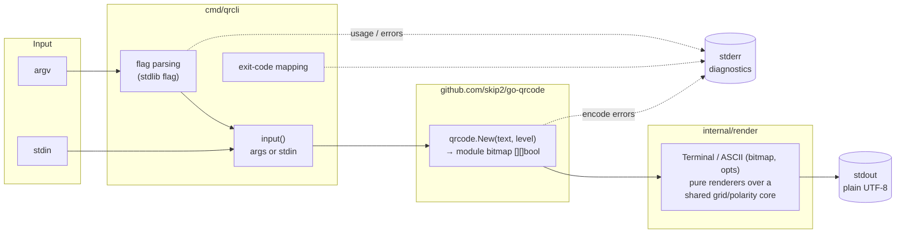
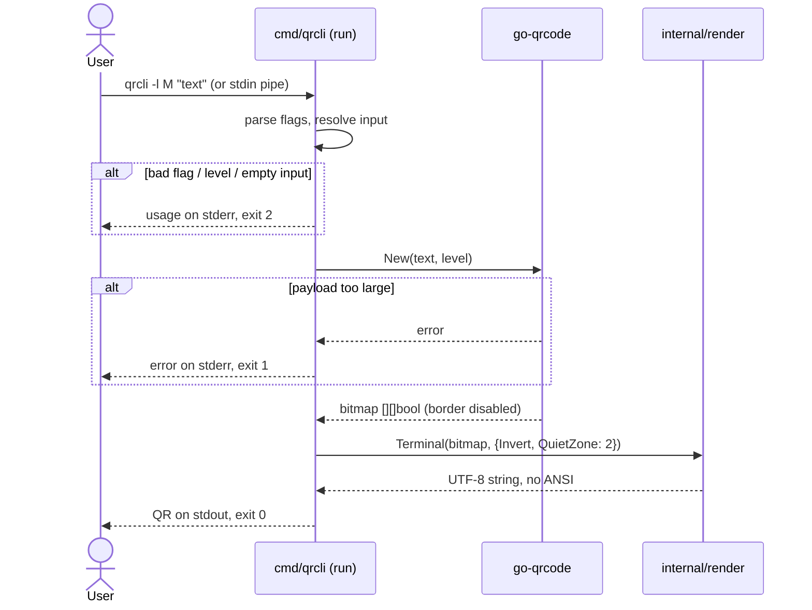
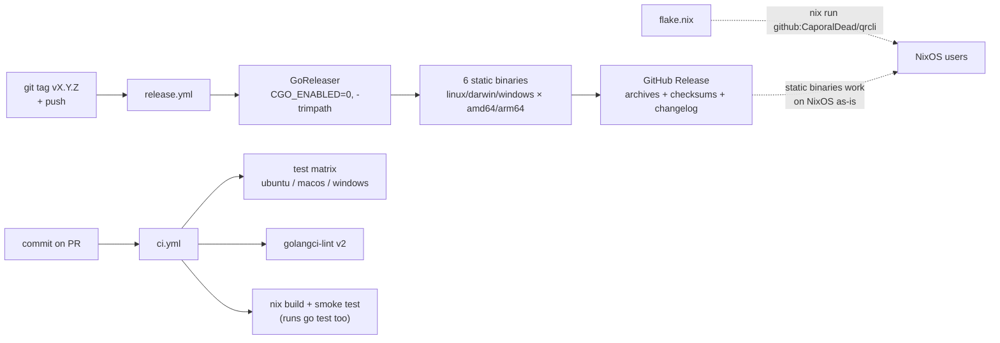

# Architecture

qrcli is deliberately small: one command, one dependency, two packages. This
document describes the moving parts, their contracts, and where the design
decisions behind them are recorded.

## Components

Separation of concerns:

| Package | Responsibility | Testing strategy |
|---|---|---|
| `cmd/qrcli` | CLI surface: flags, input selection, exit codes, version | `run()` takes injected `io.Reader`/`io.Writer` — table-driven integration tests without executing a binary |
| `internal/render` | Pure `[][]bool → string` mapping (half-blocks, quiet zone, polarity) | exact-string table-driven tests |
| `skip2/go-qrcode` | QR encoding (versions, masks, Reed-Solomon) | not ours — treated as a black box |

## Generation flow

## Rendering model

Two vertically stacked QR modules map to one character cell via half-blocks
(`▀`, `▄`, `█`, space). By default the **light** modules are drawn as filled
blocks so the code reads dark-on-light on dark terminals; `--invert` flips the
mapping for light terminals. The renderer adds its own 2-module quiet zone
(the library border is disabled). Full rationale: [#2](https://github.com/CaporalDead/qrcli/issues/2).

`--ascii` selects a second renderer for terminals without Unicode block
glyphs: `##` per lit module, one row per module, pure 7-bit output — twice as
large in both directions. Both renderers share the same quiet-zone/polarity
core (`grid`), so `--invert` behaves identically in either mode. Rationale:
[#15](https://github.com/CaporalDead/qrcli/issues/15).

Properties relied on by tests:

- output is deterministic for a given (payload, level, options) triple;
- every line has the same rune width (`size + 2 × quietZone` for half-blocks,
  doubled in ASCII mode);
- inverting changes glyphs but never dimensions (**rune** count, not bytes —
  see the pitfall in [PR #7](https://github.com/CaporalDead/qrcli/pull/7));
- no ANSI escape sequences anywhere: output survives pipes, redirects, CI logs.

## Error contract

| Condition | Stream | Exit code |
|---|---|---|
| success | QR on stdout | 0 |
| encoding failure (payload too large) | stderr | 1 |
| usage error (unknown flag, bad level, empty/missing input) | stderr (+ usage) | 2 |

Interactive stdin with no argument fails fast (exit 2) instead of blocking on
a read that will never come.

## Release pipeline

## Decision log

The issue tracker is the source of truth; this table is just the map.

| Decision | Where |
|---|---|
| Go + skip2/go-qrcode + stdlib flag (vs Rust, Node, Python) | [#1](https://github.com/CaporalDead/qrcli/issues/1) |
| Half-block rendering, polarity default, quiet zone = 2 | [#2](https://github.com/CaporalDead/qrcli/issues/2) |
| CI matrix, GoReleaser, SemVer & Conventional Commits policy | [#3](https://github.com/CaporalDead/qrcli/issues/3) |
| Nix flake, vendorHash & git-tracked-files pitfalls | [#4](https://github.com/CaporalDead/qrcli/issues/4), [PR #13](https://github.com/CaporalDead/qrcli/pull/13) |
| `--ascii` fallback renderer (`##`, graduated from the backlog) | [#15](https://github.com/CaporalDead/qrcli/issues/15) |
| Rejected/parked ideas (image export, payload helpers…) | [#5](https://github.com/CaporalDead/qrcli/issues/5) |
